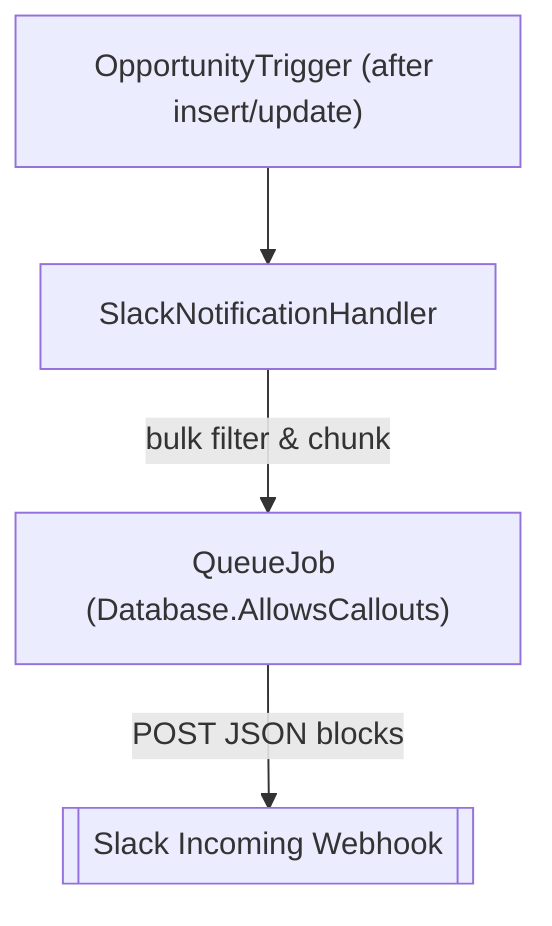

# Salesforce + Slack Notification Integration (Portfolio)

> 完成版：このリポジトリは転職用ポートフォリオとして整理した完成版です。学習途中の履歴は別リポジトリに残しています。


---

## 概要

Salesforce の商談（Opportunity）作成・更新（フェーズまたは金額の変更）をトリガーに、Slack の指定チャンネルへ通知するポートフォリオです。標準連携では難しい「通知条件・メッセージの細かい制御」を **Apex + Webhook** で柔軟に実現しています【216642647232840†L289-L296】。

- **非同期処理（Queueable / AllowsCallouts）でバルク安全・ガバナ制限に配慮**
- **閾値や対象ステージは Custom Metadata Type (CMDT) でノーコード管理**
- **Webhook URL は Named Credential に外出ししてシークレットをコードに持たない**

---

## デモ（イメージ）

> スクリーンショット差し替え想定：`docs/screenshot‑slack.png` を後日追加予定。

```
[商談更新] ACME – 新規導入案件
フェーズ: Negotiation/Review (確度 50%)
金額: ¥3,000,000
担当: Taro Sales
備考: 9/15 見積再提示
```

---

## アーキテクチャ



### 主要コンポーネント

- **OpportunityTrigger.trigger**
  - after insert/update で発火し、ロジックはハンドラーに委譲。
  - トリガ自体は薄く保ち、保守性を確保します【216642647232840†L326-L329】。
- **SlackNotificationHandler.cls**
  - `Queueable, Database.AllowsCallouts` で非同期 POST。Slack Block Kit の `blocks` を組み立て、複数商談を1リクエストで送信します【216642647232840†L330-L337】。
  - フィルタ条件：
    - 新規作成時は必ず通知。
    - 更新時はフェーズ/金額が変化した場合のみ通知。
    - CMDT の金額しきい値・対象ステージを適用します【216642647232840†L333-L336】。
  - Slack 制約（50 ブロック/メッセージ）に対応するため、最大15件/メッセージになるようチャンク分割して送信します【216642647232840†L337-L339】。
- **SlackConfigProvider.cls**
  - CMDT `Slack_Config__mdt` から `Enabled__c` / `MinAmount__c` / `TargetStages__c` を読み込み提供します【216642647232840†L340-L343】。
  - 未設定時でも安全なデフォルト動作を提供します。
- **SlackHttpMock.cls**
  - `HttpCalloutMock` を実装し、リクエスト回数や本文を蓄積。レスポンスコードを動的に切り替えられるため、単体テストで成功／失敗の両方を再現できます【216642647232840†L344-L345】。

---

## セットアップ

### 0) 前提

- Salesforce 組織（Sandbox / Dev Org）
- Slack ワークスペース（アプリ「Incoming Webhooks」を有効化）
- Salesforce CLI（新 CLI）：`sf` コマンドが使えること【216642647232840†L353-L355】

### 1) Slack Webhook URL を発行

1. Slack で Incoming Webhooks を有効化します【216642647232840†L358-L360】。
2. 通知先チャンネルを選択して Webhook URL を取得します【216642647232840†L358-L361】。

### 2) Salesforce 側の準備

1. **Named Credential** を作成します【216642647232840†L364-L369】。
   - 設定 → 指定ログイン情報 → 新規
   - ラベル: `Slack Webhook` / 名前: `Slack_Webhook`
   - URL: 取得した Webhook URL
   - 認証: なし（匿名 POST）
   - 利用ユーザへ権限セット割り当てを忘れない
2. **Custom Metadata Type (CMDT)** を作成します【216642647232840†L370-L378】。
   - 設定 → カスタムメタデータ型 → 新規
   - ラベル: `Slack Config` / API 名: `Slack_Config`
   - 項目:
     - `Enabled__c` (Checkbox)
     - `MinAmount__c` (Number/Decimal)
     - `TargetStages__c` (Text, カンマ区切り: 例 `Prospecting, Negotiation/Review, Closed Won`)
   - レコード `Default` を作成し上記項目を設定します。

### 3) デプロイ & テスト

```bash
# 接続
sf org login web --alias MyOrg
sf config set target-org=MyOrg

# デプロイ
sf project deploy start --source-dir force-app --ignore-conflicts【216642647232840†L382-L388】

# 単体テスト（必要に応じてクラス名を調整）
sf apex run test --tests SlackNotificationHandlerTest --result-format human【216642647232840†L389-L390】
```

---

## 使い方

- 商談の **フェーズ** または **金額** が変化したときにトリガが抽出し、ハンドラが Slack へ送信します【216642647232840†L394-L397】。
- メッセージは Block Kit 構造で、読みやすいカード風のレイアウトになります【216642647232840†L397-L398】。

### 送信 JSON（例）

```json
{
  "blocks": [
    { "type": "header", "text": { "type": "plain_text", "text": "商談更新" } },
    { "type": "section", "fields": [
      { "type": "mrkdwn", "text": "*商談名*\n ACME - 新規導入案件" },
      { "type": "mrkdwn", "text": "*フェーズ*\n Negotiation/Review (50%)" },
      { "type": "mrkdwn", "text": "*金額*\n¥3,000,000" },
      { "type": "mrkdwn", "text": "*担当*\n Taro Sales" }
    ]},
    { "type": "section", "text": { "type": "mrkdwn", "text": "*備考*\n 9/15 見積再提示" } },
    { "type": "divider" }
  ]
}
```

---

## カスタマイズ

- **通知しきい値** – `MinAmount__c` に金額下限をセット（未設定なら無効）【216642647232840†L420-L421】。
- **対象ステージ** – `TargetStages__c` にカンマ区切りで列挙（空なら無効）【216642647232840†L421-L422】。
- **ON/OFF** – `Enabled__c` で一時停止が可能【216642647232840†L422-L423】。
- **拡張** – Teams/Discord/Google Chat などの Webhook にも容易に派生できます【216642647232840†L423-L424】。

---

## セキュリティ

- Webhook URL は Named Credential に格納し、コードやリポジトリに含めません【216642647232840†L429-L430】。
- GitHub では Push Protection / Secret Scanning を有効にします【216642647232840†L429-L431】。
- テストやログでシークレットを出力しないようにし、`System.debug` の取り扱いに注意します【216642647232840†L431-L432】。

---

## 運用ガイド

- **ログ監視**：失敗時は `System.debug(ERROR, ...)` が出力されます（本番は監査用カスタムオブジェクトや Platform Event へ移行可）【216642647232840†L437-L438】。
- **負荷対策**：1 トランザクション=1 ジョブ運用。大量更新は Platform Events 等へ拡張余地があります【216642647232840†L438-L439】。
- **変更管理**：閾値・ステージ変更は CMDT で即時反映可能（デプロイ不要）【216642647232840†L439-L440】。

---

## 複数レコード処理（バルク対応）

本実装は 1 トランザクションにつき1回だけ `enqueueJob` し、Queueable Apex 内で複数レコードをまとめて Slack に通知する方式を採用しています【216642647232840†L446-L449】。

### 設計ポイント

- **Trigger 側**
  - 商談のフェーズ／金額が変化したものだけを抽出【216642647232840†L454-L456】。
  - 変更 ID を `Set<Id>` で一括管理し、重複を排除します【216642647232840†L454-L456】。
  - `System.enqueueJob(new SlackNotificationHandler(ids))` を1回だけ呼び出します【216642647232840†L456-L457】。
- **Queueable 側**
  - 渡された ID を SOQL でまとめて取得します【216642647232840†L458-L459】。
  - CMDT の条件（Enabled, MinAmount, TargetStages）でフィルタします【216642647232840†L459-L461】。
  - Slack Block Kit の 50 blocks 制限に対応するため、チャンク分割（最大15件/メッセージ）して複数 POST します【216642647232840†L461-L463】。

コード抜粋（チャンク処理部）:

```java
Integer baseBlocks = 2;   // 先頭 section + divider
Integer perRecord  = 3;   // 1件あたり section + actions + divider
Integer maxBlocks  = 50;
Integer maxPerMessage = (maxBlocks - baseBlocks) / perRecord; // 16件まで
Integer CHUNK = Math.min(15, maxPerMessage); // 安全に15件まで

for (Integer i = 0; i < filtered.size(); i += CHUNK) {
    List<Opportunity> chunk = filtered.subList(i, Math.min(i + CHUNK, filtered.size()));
    List<Object> blocks = new List<Object>();
    blocks.add(sectionText('*商談更新* :bell:（まとめ通知 ' + (i / CHUNK + 1) + '/' +
                   (Integer)Math.ceil((Decimal)filtered.size() / CHUNK) + '）'));
    blocks.add(divider());
    // ... 各商談を section/actions で追加 ...
    doPost(JSON.serialize(new Map<String, Object>{ 'blocks' => blocks }));
}
```

---

## トラブルシュート

- **ApexClass XML エラー（`cvc-elt.1.a`）** — メタ XML が SFDX 形式になっているか確認します（`<ApexClass xmlns=...>` / `<ApexTrigger xmlns=...>`）【216642647232840†L484-L487】。
- **`Invalid type: SlackConfigProvider.Conf`** — 依存順を確認し、`SlackConfigProvider` のデプロイが先行しているかチェックします【216642647232840†L488-L489】。
- **Slack が 401/403** — Webhook URL が無効または権限不足です。Named Credential を再確認します【216642647232840†L490-L491】。
- **Git の push で non-fast-forward** — 初期 README がリモートにあるだけなら `git push --force-with-lease` で上書きします【216642647232840†L492-L493】。

---

## ライセンス

このポートフォリオは学習・採用選考の評価目的で公開しています。商用利用や再配布はご相談ください【216642647232840†L495-L500】。

---

## 著者

- **@pi-cpu** — Salesforce エンジニア（Apex／API 連携／テスト自動化）
- 目的：**「標準を尊重しつつ、必要なところだけコードで拡張」** を実務レベルで示すこと【216642647232840†L505-L507】。

---

## 今後の拡張とセキュリティ強化プラン

本ポートフォリオはシンプルな通知アプリケーションとして完成していますが、今後さらなる価値を提供するために以下の拡張とセキュリティ強化を検討しています。

### 今後の拡張

- **通知対象オブジェクトの拡大** – 商談だけでなく、リードやケースなど他の Salesforce オブジェクトの作成・更新にも対応させます。
- **インタラクティブメッセージ対応** – Slack のボタンやセレクトメニューを用いて、通知から直接 Salesforce レコードの承認や更新を行えるようにします。
- **双方向連携** – Slack の Slash コマンドやカスタムアプリを介して、Slack から Salesforce にデータ登録や検索を行える仕組みを追加します。
- **多言語化とカスタマイズ** – メッセージテンプレートを設定ファイル化し、日本語以外の言語や顧客独自のフォーマットに対応します。

### セキュリティ強化プラン

Salesforce や Slack の標準機能に加え、個人のポートフォリオとしてすぐに実行できるセキュリティ対策を以下にまとめます。

- **シークレットの安全な管理** – Webhook URL やアクセストークンなどの機密情報は Named Credential や環境変数に保存し、コードやリポジトリには含めません。また、GitHub の Push Protection と Secret Scanning を有効にして、コミット時にシークレットが検出された場合はブロックや警告を受けられるようにします。この機能はプッシュ時にコードをスキャンし、潜在的なシークレットを検出してコミットをブロックすることでデータ漏洩のリスクを大幅に低減します【104654944485303†L541-L554】。
- **多要素認証（MFA）の有効化** – 個人の Salesforce 開発環境や Slack ワークスペースでも MFA を有効にし、認証強度を高めます。MFA はフィッシングや認証情報詐取に対する強力な防御手段であり、データ保護の壁を強化します【527837717143616†L313-L331】。
- **強固なパスワード運用** – 複雑でユニークなパスフレーズを使用し、定期的に変更するなどのパスワード管理を徹底します【527837717143616†L405-L416】。パスワード管理ツールを活用して安全に保管し、他サービスとの使い回しを避けます。
- **アクセス権限の最小化** – 試験用に複数のユーザを作成する場合は必要最小限の権限のみ付与し、不要になったユーザや権限は削除します【527837717143616†L332-L347】。
- **信頼できる IP からのアクセス** – Salesforce のログイン IP 制限を利用し、自分のネットワークや開発環境からのみログインできるよう設定することで不正アクセスを防止します【527837717143616†L350-L357】。
- **強固なローカル環境** – 自身の開発マシンに最新のセキュリティパッチを適用し、ウイルス対策やファイアウォールを有効にします。また、Slack からの Webhook 受信先も開発専用のワークスペースに限定します。

---

## 設計の工夫ポイント

本プロジェクトでは、保守性・拡張性・テスト容易性を高めるために以下のような設計上の工夫を取り入れています。

- **薄いトリガとハンドラパターン** – Opportunity の after insert/update トリガではロジックをハンドラーへ委譲し、トリガ自体を薄く保って保守性を向上させています【216642647232840†L326-L329】。
- **非同期キュー処理** – `Queueable` と `Database.AllowsCallouts` を併用することで、複数商談をまとめて非同期に通知し、ガバナ制限やバルク処理に配慮しています【216642647232840†L330-L339】。
- **Block Kit 制限を考慮したチャンク分割** – Slack は 1 メッセージあたり 50 ブロックまでという制約があるため、チャンク分割して最大 15 件/メッセージにまとめるアルゴリズムを組み込んでいます【216642647232840†L337-L339】【216642647232840†L461-L463】。
- **設定値のメタデータ化** – 通知の有効/無効、金額しきい値、対象ステージなどの条件は Custom Metadata Type から取得するため、ノーコードで即時変更が可能です【216642647232840†L333-L337】【216642647232840†L340-L343】。
- **シークレットの外部化** – Slack Webhook URL は Named Credential に保存し、リポジトリに平文で含めないことでセキュリティを高めています【216642647232840†L429-L430】。
- **テスト容易性** – `HttpCalloutMock` を実装し、実際の Slack へ送信することなくリクエスト内容やレスポンスを検証できるように設計しています【216642647232840†L344-L345】。
- **バルク対応の一括 enqueue** – 1 トランザクションにつき 1 回だけキューを登録し、その中で複数レコードを処理することで、無駄なジョブの生成や重複通知を防いでいます【216642647232840†L446-L449】。

